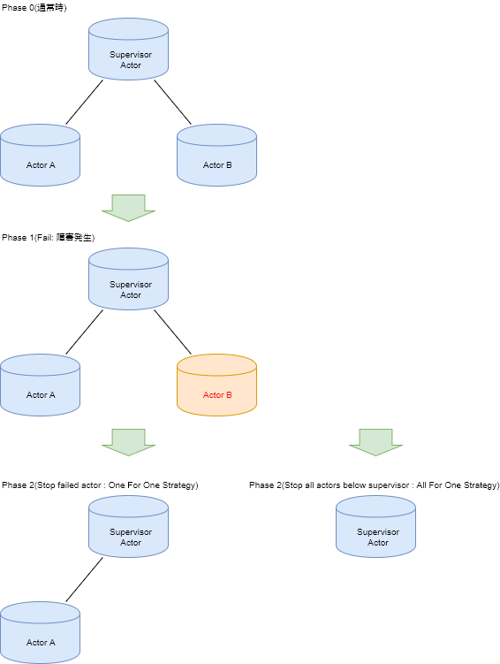

# Akka

* `Jonas Boner`が開発

* 本章では`v2.3.14`(+ JDK1.8)に限定する

## Akkaを取り上げる理由

* 現在稼働している多くの並列分散処理を担う業務アプリケーションはAkkaを実装している

* レガシーシステムからAkkaに移行するニーズが高まっている
  * エリクソン社のアップタイムが99.99999999%という通信インフラシステム(Erlangで開発)の安定性と同レベルの結果が出ているとの成功事例あり

## Akkaの特徴

* アクターモデルの一単位を構成するアクターは軽量
  * メモリ等のリソース消費で効率的に稼働する
  * Akkaでは1GBのメモリーで、アクターを270万個生成することが出来る
  * アクター間の通信(メッセージ)は平均的なスペックの端末でも`5000万メッセージ/sec`程度の処理速度がある

* Akkaは従来のシステムアーキテクチャーに比べると、ビジネスロジックと例外処理管理の分離が明確になっている
  * 障害対策やパフォーマンスにおいて顕著な改善効果があるとされる

## 自己治癒アルゴリズム(Self-healing algorithm)

* 自己治癒アルゴリズム(`Self-healing algorithm`)をスローガンとしている
  * 障害発生時でもアプリケーション全体を落とさないイベント管理の機構を備える
  * `アプリケーションが障害発生時の回復のための戦略を指定することが可能`

## Let it Crash

* Akkaの設計哲学には`Let it Crash`というモットーが存在する
  * アクターに問題が発生することは自然な事なので、それを抑制するのではなく、当然のこととして受け止める
  * むしろ早めに問題のあるアクターをクラッシュさせる

* それをクラッシュの情報を持つ管理機構が処理する、という流れを想定しており、実際に大きな効果を上げている
  * 障害発生抑制のために過度に注意を払ってきた過去の防衛的プログラミングから`non-defensive programming`を提唱する開発者も出てきた

* Akkaのアクターには以下の障害発生時の戦略が用意されている
  * `OneForOneStrategy`
  * `AllForOneStrategy`

* こうした障害処理の仕組みは高いアップタイムの源泉といえる
  * アップタイム：コンピューター等が起動している状態の時間

* 全てのアクターは`Supervisor`というノード管理機構を持つ
  * Supervisorの機能
    * アクターで構成するツリーデータ構造の下層に位置する子アクターに対して適用される
    * 通常アクターはツリー構造を持たない
      * アクター間で親子関係を持つには明示的な宣言が必要

* Supervisorとなる親アクター
  * 子アクターに問題が発生した場合、子アクターから通知を受ける
  * 障害が発生した子アクターのリスタートや停止処理をすることができる

* Akkaは単にアクターモデルを実装しただけではなく、極めて綿密なシステム管理を可能にする

## OneForOneStrategys

* デフォルトの戦略
  * 「Supervisor機構を有効としたアクターがリンクした子アクター」に障害が発生した場合、自動的に適用される

* 障害が、あるアクターで発生した場合(Phase1)
  * 担当のSupervisorに例外発生通知がくる
    * `該当するアクター`を終了・リスタートの指定が可能

## AllForOneStrategy

* 障害が、あるアクターで発生した場合(Phase1)
  * Supervisor(親アクター)の下に配置された`全ての子アクター`を終了・リスタート可能