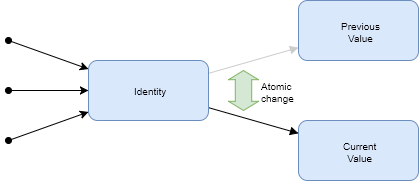

# STM(SoftWare Transactional Memory)

* STM
  * ACIDからDを除いた、ACIの機能を持つように設計されている
    * Atomicity(原子性), Consistency(一貫性), Isolated(独立性)
    * 3つの性質を持つトランザクションを保障する
  * 並列計算を行う際の共有メモリへのアクセス法

* Atomicity(原子性)
  * 一連の処理は、全体として実行されるか、実行されないかどちらかであることが保証される
  * `java.util.concurrent`パッケージのAtomic変数と類似した機能をもつが、STMでは変数はすべて不変(Immutable, イミュータブル)

* Consistency(一貫性)
  * 処理結果がある条件や整合性を保つことが保証される
  * 変数の変更には過去の値(Previous Value)から現在の値(Current Value)の変数にポインターをスイッチさせる
  * この際に更新に失敗すれば前の値に巻き戻される
    * これにより一貫性を保つ

* Isorated(独立性)
  * その処理について、結果だけが他から見ることができる
  * 実行中の途中状態が他へ影響することがない
  * 他のスレッドから変更処理が見えない設計

* AkkaのSTMでは、Oracleのトランザクションの分離性レベルで最も厳しいSerializableと同等の一貫性となる設計であると主張している

* 値の更新
  * 複数の参照リクエストが、ある変数の値を書き換えるのではない
  * 不変性をもつ変数を新たに作り、参照先のメモリーアドレスを変えることにより値を更新する
  * `Identityを変更する`と呼ぶことがある

* STMにおいて、可変性はIdentityに対してのみ許可している
  * IdentityはScalaのscala.concurrent.stmパッケージが提供するRefに該当する

* `scala.concurrent.stm.japi.STM.atomic(Callable<Object> arg0)`
  * atomicメソッドの中に定義されるブロック内のcallメソッド内がトランザクションが処理する部分
  * STMがトランザクションとして、スレッドセーフなアクセスを保証する部分

## フォールトトレラント(障害許容、Fault tolerant)

* `フォールトトレラント`
  * その構成部品の一部が故障しても正常に処理を続行させること

* デッドロックと競合条件の問題を排除することそれ自体がある意味フォールトトレラントである

* `STMには失敗したトランザクションから回復するための障害耐性機構が用意されている`
  * データベースでは一般的なトランザクションの機能であるコミットやロールバック

* STMの基本設計として`トランザクションに失敗した場合、前の状態に戻る`

* マルチスレッドにおいて競合条件が発生した場合
  * コミットされるまでの変更は削除される事はなく、戻れる状態とする
  * コミットした後に変更が有効となる

* 戻される場合の失敗したコールはどうなるか
  * 成功するまでリトライする
  * 失敗した処理のインターセプトをするメソッドも用意されている