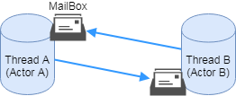

# アクターモデル

## アクターモデルの第一原理

* 全てがアクターである(`Everything is an actor`)
  * OOP信奉者の「全てがオブジェクトである(`Everything is an object`)」と類似する
  * オブジェクトをアクターで書き換えたものだが概念が本質的に異なる

## アクターとは

* スレッドに割り当てられたオブジェクトの様なイメージ
  * 通常とは違う性質を持つオブジェクトと考えればよい

## アクターの性質

* 全てのアクターはメッセージを受信するメールボックスを持つ
  * AkkaではonReceiveメソッドで実装する

* 受信したメッセージへは返答が可能
  * 返答のアクションは３つの選択肢がある
    * メッセージを他のアクターに送信
    * 新たなアクターを生成
    * メッセージに対する振る舞い(behaviour)を再定義
  * シーケンシャルでは無く、並列で処理される
  * メッセージは非同期
    * ただしメッセージをした場合に返答を待つことがでできるメソッドもあり

* アクターの設計は、メッセージを一度に１つしか処理できない`シングルスレッド`である
  * マルチスレッドのように振舞うのはAkka等のフレームワークがバックグラウンドでやっているもの

* アクターは`リモートでも動作する`ためリモート間のやりとりが可能
  * 単一ノード同様にメッセージを送受信することが可能
  * ネットワーク上のメッセージについてはシリアル化して送受信される

## アクターの関連図

* アクターはメールボックスのアドレスさえ知っていれば、そのアクターに対してメッセージを送信できる

* 取り得る3つ以上アクターがいる場合のトポロジー(位相)
  * メッシュ
    * 全てのアクターが互いのメッセージボックスのアドレスを知っている
  * 円環
    * A > B > C > A といった循環する有向関係
  * etc

* Akkaを利用すれば、アクターモデルがオブジェクト指向なJavaでも違和感なく実装できる