# Tag VLAN

* VLANにおける接続方式の一つ

* データにそのデータが所属するネットワークの情報を付与し、制御する側はその情報をみて所属するネットワークを判断するやり方

## TagVLANではない構成

## TagVLANの構成

## 参考URL

* <https://news.mynavi.jp/article/vlan-3/>
* <http://wa3.i-3-i.info/word12091.html>