# VLAN(Virtual Local Area Network)

* 元々のネットワークを論理的に区切る、まとめる等した「本当は違うけど、そういうことにする」ネットワーク

  

* 上記例だとコンピュータ1,2で1つのネットワーク、コンピュータ3,4,5で1つのネットワークになっているといえる
  * 物理的には1つのネットワーク
  * 論理的には2つのネットワーク

* このように、論敵的に分けたネットワーク、あるいはその仕組みをVLANという

* VLANにおいて、スイッチはどのコンピュータがどのネットワークに所属するかを管理する
  * 同じネットワークに所属するコンピュータ同士であれば中継する
  * 違うネットワークに所属するコンピュータ同士であれば中継しない

* 何をもって「どのコンピュータ」や「どのネットワーク」を判断しているのか
  * ポートベースVLAN
  * MACベースVLAN
  * サブネットベースVLAN
  * ユーザベースVLAN(=認証VLAN)
  * プロトコルベースVLAN
  * タグVLAN
  * マルチプルVLAN

