# ネットワークの設定確認と接続テスト

## ping(Packet Internetwork Groper)コマンドによる確認

ネットワークに繋がっていて、IPアドレスを持っている機器であれば、インターネット上でも家庭や会社の内部LANでもpingで疎通確認可能

### 確認順序

1. TCP/IPモジュールの動作確認  
 ループバックアドレス(127.0.0.1)を使用したループバックテストを行う
1. NIC(Network Interface Card: 192.168.0.8)の動作確認
1. サーバ(192.168.0.18)までの接続確認とサーバの動作確認
1. ルータ(192.168.0.100)までの接続確認とルータの動作確認
1. プロバイダDNSまでの接続確認
1. インターネット上の目的のサーバの接続確認

``` cmd
ping 127.0.0.1
ping 192.168.0.8
ping 192.168.0.18
ping 192.168.0.100
ping ns1.isp.ne.jp
ping www.yahoo.co.jp
```

### ping返事なしの場合

* 応答タイムアウト
  * 考えられる原因
    * 配線が切れている
    * そのシステムが停止している
    * そのシステムがpingを拒否している(FW, Virus対策ソフトなど)
    * 純然たるタイムアウト（ネットワークが混んでいる）
    * etc.

* ping
  * pingが通る
    * ネットワーク上でつながっている
  * pingが通らない
    * ネットワーク上でつながっていない
    * もしくはpingに応答しない

### ICMP(Internet Control Message Protocol)

* IPパケット内にある
  * ICMPヘッダはMAC、IPヘッダの後ろにある
    * MACヘッダ|IPヘッダ|ICMPヘッダ|データ

* ICMPヘッダ
  * フィールドに「タイプ」「コード」がある
  * 「タイプ」「コード」で通知の種類を表現する
  * 特に主要なものは以下
    * 8: Echo Message
    * 0: Echo Reply Message
    * 3: Destination Unreachable Message
    * 5: Redirect Message
  * tcpdumpで実際に確かめる

#### 8: Echo Message, 0: Echo Reply Message

``` figure
    echo request(8)
C-------------------->S
    echo response(0)
C<--------------------S
```

#### 3: Destination Unreachable Message

* 特に主要なコードは以下
  * 0: Destination network unreachable
  * 1: Destination host unreachable

* 参考：<http://beginners-network.com/icmp.html>

#### 5: Redirect Message

* ルーターに送られてきたパケットの宛先が、同一サブネット内の異なるルーターに送った方がメトリックが小さい時に、直接送信した方が早い事を通知
  * メトリック
    * コンピュータネットワークで宛先までのパス（経路）の「距離」を示す指標

``` figure
        [R(DGW)]
          |
--------------------------
 |                |
[s]              [R]
                  |
            --------------
                        |
                       [d]

```

* s -> d へのパケット送信
  * R(DGW)はルーティングテーブルを見てルータ(R)に送信する
  * 数値的にRに送ったほうが良いことをsに通知する
  * sは自身のルーティングテーブルにそのルート情報を乗せる

### tracerouteコマンド

* どういう経路を通ったかを調べる
* Winでは`tracert`

``` cmd
tracert -4 www.google.com
```

* 参考：<http://www.atmarkit.co.jp/ait/articles/0108/30/news003.html>

## NIC(Network Interface Card)

* コンピュータなどの機器を通信ネットワーク(LAN)に接続するためのカード型の拡張装置

* ネットワークアダプタ(NIC)のリソースは他のリソースと競合する場合があるため、一応確認する必要がある

### netstatコマンド

* netstat
  * ネットワークの問題解決に役立つツール
  * ホスト自身のコネクションの状態を調べる
  * 以下を表示する
    * 実行した時点で有効なコネクション
    * ネットワークの統計情報
    * etc

* コネクション
  * TCPを使ってクライアント-サーバー間に構築される仮想的な通信経路のこと

* TCPポートの考え方
  * TCP/UDPでは、送信元ポートに任意の番号が使われる
    * TCPでは一般的にWebサーバ:80, POP3サーバ:110が利用される
    * しかしこれはあくまでサーバ側の「待ち受けポート番号」
    * クライアント側のポート番号は1024～49151(ユーザーポート)からランダムに利用される
      * クライアント側の送信元ポート番号は、ネットワークアプリケーションの要求に応じて、空いている番号をOSが割り当てる
      * 同じWebブラウザを複数開いても別のポート番号が割り当てられる
  * こうすることで、同時に複数のサーバと通信中でも、返信するパケットをどのアプリケーションに渡せばよいのか、ポート番号から識別できる

``` figure
Webブラウザ, メーラ
|a:2000|<------------------------>|80:Webサーバ|
|      |       ------------------>|
|      |       |
|a:2001|<-------------
               |     |
               |     |
|b:3000|<-------     ------------>|110:POP3サーバ|
Webブラウザ
```

* すべてのコネクションとLISTENINGポートを表示

``` cmd
netstat -a
```

* IPアドレスとポート番号を数字で表示する

``` cmd
netstat -n
```

* ルーティングテーブルを表示する

``` cmd
netstat -r
```

#### TCPの状態遷移図



* 参考
  * <http://www.atmarkit.co.jp/ait/articles/0402/13/news096_3.html>