# Linuxシステム

* Linux
  * Linus Torvalds UNIX, Linuxはリヌックスに近い発音
  * フィンランドの学生だったLinux Torvalds(リーナス・トーバルズ)が作成した
  * 1991年にオープンソースをベースに最初から開発したSystem-V系のUNIX互換OS
  * オープンソース

* カーネル部分がLinusの管理しているLinuxで、ディストリビューションはだいたい4つの系統で提供されている
  * Debian/GNU Linux 
    * 及びその系統のUbuntu
  * 商用のRed Hat Enterprise Linux (RHEL)
    * 及びその系統のCentOS(The Community ENTerprise Operating System)/Vine Linux
  * Slackware
    * 及びその系統のopenSUSE
    * 及び日本人の小島光弘氏が開発したSlackwareベースのPlamo Linux
  * その他日本の会社がサポートしているTurbo Linux等

* Linuxが発展した理由
  * 広く出回っているPC上で動作する
  * Windowsと同様にGUIベースで簡単にインストールできる
  * TCP/IPというインターネットを標準装備したUNIX互換である
  * 世界中の技術者がボランティアで技術を研磨して優れたソフトウェアを提供している
  * Oracleをはじめとする商用のデータベース・ソフトウェアが動作する
  * PCの主要なハードウェア・ベンダーもサポートしている
  * PCのみならず、ワークステーション上でも動作する

* Fedora, RHEL, CentOSの関係性
  * Fedora -> RHEL -> CentOS
    * Fedoraで開発して安定したものがRHELにマージされる
    * RHELの商用に関係しない部分がCentOSによって提供される
  * 参考URL
    * <http://openstandia.jp/oss_info/centos/>

## CentOSのブート処理の詳細

## Linuxのディレクトリ構造

* Windows同様ファイル・システムと呼ばれるツリー構造[WIP]

  

* 参考
  * <https://www.linuxmaster.jp/linux_skill/2010/02/06linux.html>

## UNIXコマンド/シェルスクリプト

* シェル
  * <http://www.cc.kyoto-su.ac.jp/~hirai/text/shell.html#pipe>

## telnet/vi/ftpの併用の練習

## ワード

* ディストリビューション
* ワークステーション
* GNU(グヌー、グニュ)
* GPL
* マウント
  * <http://kazmax.zpp.jp/linux_beginner/mount_hdd.html#ah_4>
